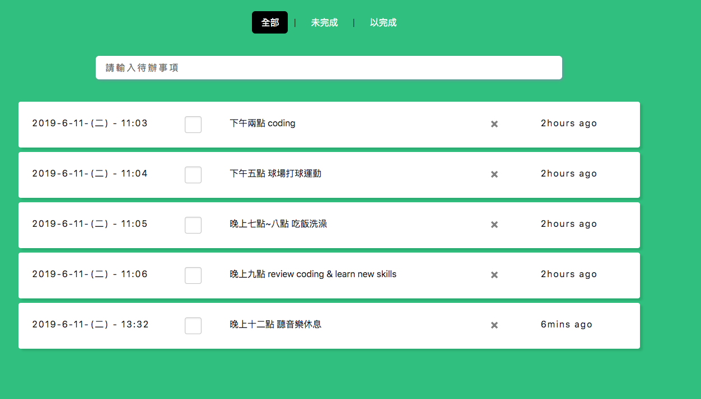

 # Vuex-todolist
- <a href="https://joechen0730.github.io/Vuex-todolist/" target="_blank"><B>Vuex-todolist</B> (RWD)</a>  
  <a href="https://joechen0730.github.io/Vuex-todolist/" target="_blank"> </a>  
  
  ### 可雙擊後修改資料，並且加上時間戳來顯示上次新增時與現在的時間差  
  <a href="https://joechen0730.github.io/Vuex-todolist/" target="_blank">       </a> 
     
  ⌞ 使用 Vue cli3 ，並用 Vuex store 將資料集中管理。 
  ⌞ 使用 router 偵測路由狀況及獲取資料。
  ⌞ 透過 localStoge 將資料儲存在本地端網頁中，使下次開網頁時並不會被清空。 
  ⌞ 將資料透過 computed 暫存，優化網頁速度及運算時間。 
  ⌞ 做出時間差模組，可得知當下發文時間及當前時間相差多少 Ex: fb 時間戳，IG時間戳 等等．．。    
