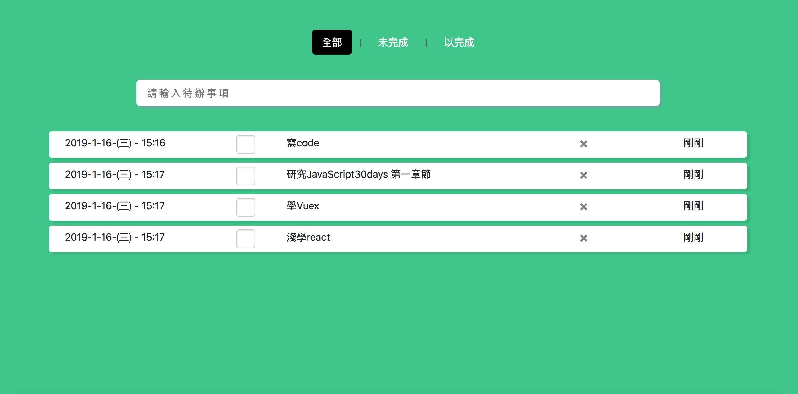

 # Vuex-todolist
- <a href="https://joechen0730.github.io/Vuex-todolist/" target="blank"><B>Vuex-todolist</B> (RWD)</a>  
  <a href="https://joechen0730.github.io/Vuex-todolist/" target="blank"> </a>  
  
  ⌞ 使用 Vue cli3 ，並用 Vuex 將資料集中管理，並透過 vue-router 去偵測路由狀況獲取資料。 
  ⌞ 透過 localStoge 將資料儲存在本地端網頁中。 
  ⌞ 可雙擊後修改資料，並且加上時間戳來顯示上次新增時與現在的時間差  
  ⌞ 將資料透過 computed 暫存，優化網頁速度及運算時間。 
